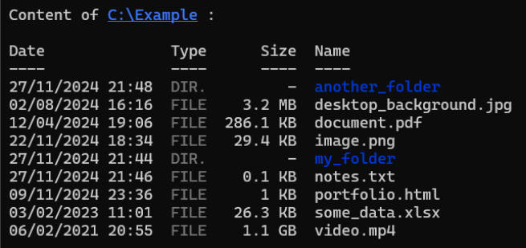

# listdir 🗂️
[](https://www.npmjs.com/package/@soniix/listdir)

## Description
``listdir`` is a simple and intuitive CLI command that lists the content of a directory, including information like file type, size and last modified time.

## Install
Make sure you have Node.js installed and run the following command :
```bash
npm install -g @soniix/listdir
```

## Usage
Once installed, use the ``listdir`` command followed by the directory path :
```bash
listdir /directory/path
```

## Example


## Useful links
- [NPM page](https://www.npmjs.com/package/@soniix/listdir)
- [Github repository](https://github.com/soniiix/nodejs-dir-list)